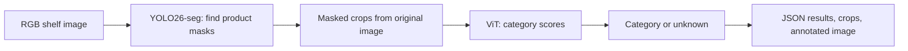

# Grocery product detection — RGB pipeline

Historical notes from before the production/training reorganisation. Commands and paths below may be outdated; use ../README.md for the current setup.

This project finds visible products in an RGB shelf image, predicts instance masks with YOLO26l-seg, and classifies masked crops with ViT-L/32. Prediction and review use the same network code and configuration. See [PIPELINE.md](PIPELINE.md) for the current commands and saved-model setup; older box-detector training instructions below describe the optional baseline experiment. You run training yourself.



## Start here

For collaborative collection and box editing in the real fridge, use the separate [annotation tool](annotation_tool/README.md). Start it with `python annotation_tool/run.py` and open `http://localhost:9000`. Multiple annotators can connect to one server through SSH.

The local `.venv` already has CPU dependencies installed. Activate it:

```bash
cd /home/hugo/Documents/grocery-product-detection
source .venv/bin/activate
python main.py --help
python -m unittest discover -s tests -v
```

On another machine:

```bash
python3 -m venv .venv
source .venv/bin/activate
python -m pip install -r requirements.txt
```

For NVIDIA GPU training, install a matching CUDA-enabled torch/torchvision pair using the [official PyTorch installer](https://pytorch.org/get-started/locally/), then install `requirements.txt`. The local CPU environment is for checking the code. A GPU is strongly preferable for ViT training. Lower `batch_size` if memory is limited; use `workers: 0` if multiprocessing causes problems.

## Installed Swedish data

See [DATASETS.md](DATASETS.md) and [references.bib](references.bib).

The Swedish Grocery Store Dataset is already prepared for **classification** with the original train/validation/test split. When you decide to train:

```bash
python main.py train-classifier --config configs/swedish_grocery.yaml
python main.py evaluate-classifier --config configs/swedish_grocery.yaml --split test
```

The first training command downloads pretrained ViT weights. This dataset has no detection boxes, so it cannot train YOLO directly. Do not run `train-all` with this configuration until you supply a box-labelled detection dataset.

## Which file does what?

| File | Purpose |
| --- | --- |
| `main.py` | Main entry point that calls the other scripts |
| `configs/rgb.yaml` | Paths and training/prediction settings |
| `configs/swedish_grocery.yaml` | Configuration for the installed classification dataset |
| `prepare_data.py` | Turn one or more box-annotation CSV files into YOLO labels and ViT crops |
| `import_grocery_store.py` | Import official Swedish dataset splits and coarse labels |
| `download_open_food_facts.py` | Download a small Swedish-market collection for label review |
| `train_detector.py` | Fine-tune YOLO26 as a one-class `product` detector |
| `train_classifier.py` | Fine-tune ViT on broad categories |
| `evaluate.py` | Evaluate either model on validation or test data |
| `predict.py` | Save predictions for one image or a folder of images |
| `grocery_rgb/classifier.py` | ViT model, transforms, checkpoints, category transfer |
| `grocery_rgb/pipeline.py` | Connect detection, cropping, and classification |
| `grocery_rgb/data.py` | Classification image loading and optional balanced sampling |
| `grocery_rgb/metrics.py` | Accuracy, macro F1, per-category metrics and confusion matrix |
| `tests/` | Synthetic data checks and real architecture smoke tests |

All scripts contain large section comments and short explanations. They can also be run directly; for example, `python train_classifier.py --config configs/swedish_grocery.yaml`.

## Use your own datasets

Detection and classification can use **different** datasets. A generic product-box dataset helps YOLO; category-labelled product images help ViT. Both need later adaptation to your fridge.

### Option A: you have boxes and category labels

Convert each source dataset's annotations to a CSV in the format shown in [examples/annotations.csv](examples/annotations.csv). The example contains placeholder image paths, not real images.

```csv
image,split,category,xmin,ymin,xmax,ymax,group
images/shelf_001.jpg,train,milk,20,10,120,200,recording_01
images/shelf_001.jpg,train,apple,140,50,220,150,recording_01
```

- Use one row per visible object. Boxes use **pixel coordinates**, not normalized coordinates. `(xmin, ymin)` is the top-left corner and `(xmax, ymax)` is the bottom-right boundary.
- Image paths are relative to their CSV file. Splits must be `train`, `val`, or `test`.
- `group` is optional. Give frames from the same video/session the same group and split. Prefix group names with dataset names when combining sources.
- Use broad lower-case category names (`milk`, `butter`, `apple`). Keep them consistent across datasets.
- A genuinely empty scene can have one row with empty category and box fields. Do not label a scene empty if it contains unannotated products.
- Annotate all visible products in a detection image. Unlabelled products become false background examples.
- For COCO `[x, y, width, height]`, use `xmin=x`, `ymin=y`, `xmax=x+width`, `ymax=y+height`. For YOLO labels, convert normalized center/size back to pixel corners if you want to use this crop converter.

```bash
python main.py prepare-data \
  --manifest /path/to/dataset_a/annotations.csv /path/to/dataset_b/annotations.csv \
  --output data/prepared
```

If original labels identify brands or variants, pass a complete mapping:

```bash
python main.py prepare-data \
  --manifest /path/to/annotations.csv \
  --mapping configs/category_mapping.example.json \
  --output data/prepared
```

The mapping example must be edited to match your labels. Missing mappings fail explicitly. Preparation writes:

```text
data/prepared/
  detection/
    dataset.yaml
    images/{train,val,test}/
    labels/{train,val,test}/
  classification/
    train/{apple,milk,...}/
    val/{apple,milk,...}/
    test/{apple,milk,...}/
  preparation.json
```

Preparation keeps your assigned splits, checks boxes and duplicate pixels across splits, and refuses to overwrite an existing prepared dataset. It cannot detect near-duplicate frames or shared physical items, so choose your groups carefully **before making crops**. Normalize EXIF rotation and box coordinates before importing rotated images. The generated detector YAML contains an absolute dataset path; update `path` if moving the data.

### Option B: you already have standard datasets

For detection, set `detector.data` to an existing Ultralytics detection YAML. It can contain multiple original classes; training uses `single_cls=True` to treat all boxes as `product`. Ensure those boxes represent grocery products, not unrelated objects. The script expects local data; prepare/download it before training.

For classification, arrange images as:

```text
your_classification_data/
  train/milk/*.jpg
  train/apple/*.jpg
  val/milk/*.jpg
  val/apple/*.jpg
  test/milk/*.jpg
  test/apple/*.jpg
```

Set `classifier.data` to that folder. The folder names define the categories; there is no fixed category limit in the code. Validation and test reuse the **training category order**, so missing folders cannot silently change label numbers. Missing validation categories produce a warning and zero support in the report. Direct folder input does not automatically audit duplicate images; preserve trustworthy source splits.

All paths inside configuration files are relative to that file. Plain detector weight names such as `yolo26l.pt` are Ultralytics download names. CLI input paths are relative to your terminal folder.

## Train the two stages

After preparing appropriate data:

```bash
python main.py train-detector --config configs/rgb.yaml
python main.py train-classifier --config configs/rgb.yaml
```

Or run both stages in order:

```bash
python main.py train-all --config configs/rgb.yaml
```

`train-all` also saves a configuration containing the resulting checkpoint paths. The stages train separately; no gradient passes from ViT to YOLO.

YOLO starts with COCO-pretrained `yolo26l.pt`. ViT starts with ImageNet weights, replaces the final layer, trains that layer first, then unfreezes the body. The body uses a lower learning rate than the new head. Training includes modest crop/rotation/colour augmentation and random erasing, AdamW, cosine learning-rate decay, gradient clipping, CUDA mixed precision when available, and early stopping on validation macro F1.

The classifier writes `best.pt`, `last.pt`, `history.json`, `classes.json`, and the run configuration. The category order is embedded in each checkpoint. Checkpoints support **new fine-tuning runs**, not exact optimizer-state resume. Choose a new output folder for each run; existing nonempty folders are protected.

## Evaluate and predict

```bash
python main.py evaluate-detector --config configs/rgb.yaml --split test
python main.py evaluate-classifier --config configs/rgb.yaml --split test
python main.py predict --config configs/rgb.yaml --source /path/to/fridge_images
```

Set `prediction.detector_weights` and `classifier.checkpoint` to your trained files. `predict` requires both checkpoints and saves an annotated image, crops, and JSON with box coordinates, detector confidence, category confidence, top three candidates, and visible category counts. Choose a new prediction output folder for each invocation.

The category score is a softmax score, **not a calibrated probability** that an item is correct or known. Tune the rejection threshold on validation images, including genuinely unfamiliar products. An unfamiliar product can still receive a high score. `unknown` is a rejection result, not an open-vocabulary recognition system.

Evaluate YOLO recall/mAP and ViT macro F1 separately. Good ViT performance on labelled crops does not establish end-to-end shelf accuracy: YOLO can miss objects or produce poor crops. Before making accuracy claims, also evaluate final category-labelled predictions on held-out fridge scenes, matching boxes to ground truth with an IoU criterion. Automated end-to-end detection/classification scoring is not yet included.

## Fine-tune in the real fridge later

1. Capture different lighting, product angles, partial views, stacks, and empty shelves. Keep entire recording sessions in one split.
2. Label visible product boxes and broad categories. Prepare the fridge dataset.
3. Copy the config. Set `detector.weights` to the earlier detector checkpoint and point `detector.data` at the fridge box labels.
4. Set `classifier.initialize_from` to the earlier ViT checkpoint, point `classifier.data` at the fridge crops, and use new output paths. Matching category rows are transferred by name; newly added categories receive fresh classifier rows. Keep old categories in the training data if you want to retain them.
5. Reduce learning rates as appropriate, retrain, then evaluate on untouched fridge sessions. Include some old-domain examples if the model starts forgetting them.

## Scope and limitations

The current pipeline handles RGB images and visible instances. It does not yet implement IR, radar, door events, temporal tracking, or added/removed inventory decisions. Visible count differences alone would be unreliable when an item moves behind another item. Later fusion needs aligned sensor timestamps, calibration, and a temporal inventory model.

A ViT is not inherently guaranteed to outperform a CNN on occlusion or angle changes. Training coverage and detection recall matter. RGB cannot identify a fully hidden product or inspect an opaque bag. You can add categories over time, but a supervised classifier cannot recognize every imaginable category without examples.

## Tests and model references

```bash
python -m unittest discover -s tests -v
python -m pip check
```

Tests use temporary synthetic data, deterministic stand-ins for pipeline edge cases, actual randomly initialized YOLO26/ViT forward passes, and a ViT backward pass without any optimizer step. They do not train, download pretrained weights, or measure recognition accuracy. Dataset import checks additionally read the installed images.

Model API references: [Ultralytics YOLO26](https://docs.ultralytics.com/models/yolo26/) and [torchvision ViT-L/32](https://docs.pytorch.org/vision/stable/models/generated/torchvision.models.vit_l_32.html). Dataset citations are in `references.bib`. Ultralytics and the datasets retain their own licenses.
